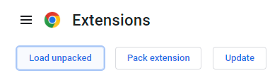
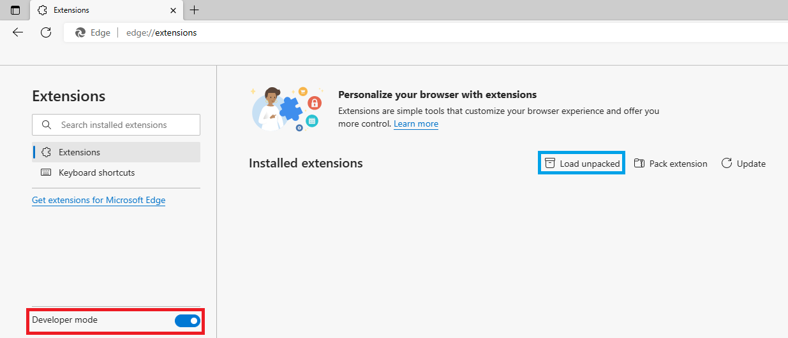

# Chrome Plugin for Bilibili live danmaku timestamp

Chrome Plugin for Bilibili live danmaku timestamp（以下简称本插件）将自动捕捉B站直播间的弹幕的发送时间，并显示在文本之后。

## Demo

## Installation

将本插件克隆到本地，然后根据不同浏览器使用不同安装步骤

### Chrome

进入[Chrome配置页](chrome://extensions)，选择左上角的Load unpacked，然后选择本插件所在文件夹即可。

### Edge

进入[Edge配置页](edge://extensions)，在左边栏中开启开发者模式（红框），然后选择右边的Load unpacked（蓝框），然后选择本插件所在文件夹即可。

## Compatibility

| Browser | Status |
| -- | -- |
| Chrome 108 | :heavy_check_mark:(2022.12.16) |
| Edge 108 | :heavy_check_mark:(2022.12.16) |